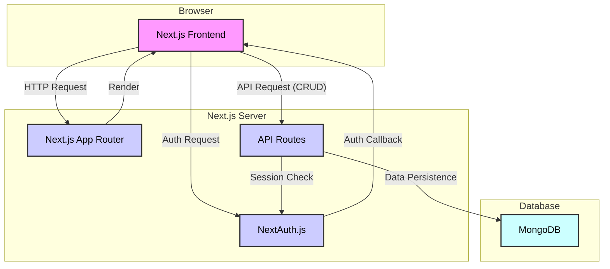
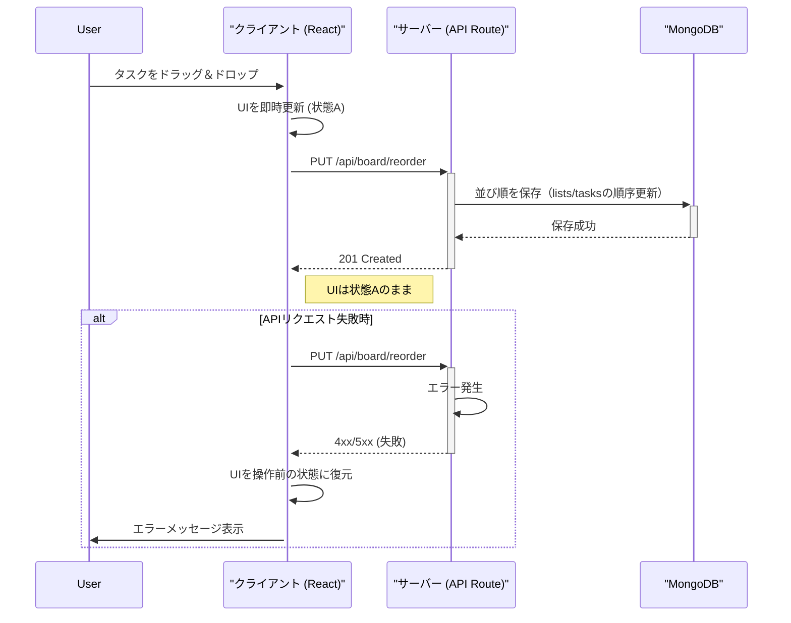
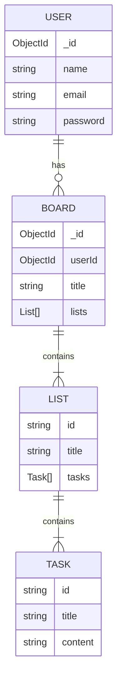

# Trello クローンアプリ

Next.js (App Router), NextAuth.js, dnd-kit を使用して作成した Trello 風のカンバンボードアプリケーションです。
ユーザー認証機能を備え、ドラッグ＆ドロップでタスクを直感的に管理できます。

※本アプリは Gemini-CLI を使って AI 駆動開発で作成したアプリです。

## デプロイ URL

[https://geminicli-todo.vercel.app/auth/signin](https://geminicli-todo.vercel.app/auth/signin)

## 機能

- **認証機能**: NextAuth.js による認証システム
  - サインアップ機能と、Credentials Provider を利用したログイン
  - ユーザー情報は MongoDB で管理
- **カンバンボード**:
  - リストとカードでタスクを可視化
  - ドラッグ＆ドロップによるカードの移動（リスト間・リスト内）
  - タスク・リストの追加、編集、削除
  - 楽観的 UI 更新によるスムーズな操作感
  - **ユーザーごとにボード情報を MongoDB で永続化**
  - 並び替えは `/api/board/reorder` によるサーバー永続化に対応

## 技術スタック

<p>
  
  
  
  
  
  
</p>

- **Framework**: Next.js 15.3.5 (App Router)
- **Language**: TypeScript 5
- **Authentication**: NextAuth.js 5.0.0-beta.29
- **UI**: React 19.1.0
- **Styling**: styled-components 6.1.19
- **Drag & Drop**:
  - @dnd-kit/core 6.3.1
  - @dnd-kit/sortable 10.0.0
- **Data Fetching/Persistence**:
  - MongoDB
- **Validation**: Zod
- **Testing**: Jest, React Testing Library, Playwright (E2E) [](https://playwright.dev)
- **Linting**: ESLint 9

## 開発環境の構築

### 前提条件

- Node.js 20 以上
- npm, yarn, pnpm, or bun
- Docker (MongoDB のローカル環境構築のため)

### インストールと実行

```bash
# リポジトリをクローン
git clone https://github.com/hideaki1979/geminicli_todo
cd geminicli_todo

# 依存関係をインストール
npm install

# MongoDBをDockerで起動
docker-compose up -d

# .env.localファイルを作成し、環境変数を設定
# MONGODB_URI="mongodb://localhost:27017/gemini-cli-app"
# NEXTAUTH_URL=http://localhost:3000
# NEXTAUTH_SECRET="opensslで生成したシークレットキー(openssl rand -base64 32)"

# 開発サーバーを起動（Turbopackを利用する場合は next dev --turbo）
npm run dev
```

ブラウザで [http://localhost:3000](http://localhost:3000) を開いてアプリケーションを確認できます。

## スクリプト

```bash
# 開発サーバー起動
npm run dev

# プロダクションビルド
npm run build

# プロダクションサーバー起動
npm run start

# コード品質チェック
npm run lint

# テスト実行
npm run test

# E2Eテスト実行 (Playwright)
npm run test:e2e

# Playwright レポート表示
npx playwright show-report
```

## アーキテクチャ

### システム構成図



### 楽観的 UI 更新のシーケンス図

タスク（カード）を別のリストにドラッグ＆ドロップで移動する際の、楽観的 UI 更新のフローを示します。



### ER 図 (データ構造)

MongoDB には、`users` コレクションと `boards` コレクションが作成されます。`boards` コレクションの各ドキュメントは `userId` を持ち、特定のユーザーに紐づきます。



### API リファクタリングのポイント

- **Zod による厳格なバリデーション**: `src/validation/boardValidation.ts`, `src/validation/userValidation.ts`
- **型の一元化**: `src/types/index.ts` の `Board`, `List`, `Task` を API 実装に適用
- **統一的なエラーハンドリング**: 認証エラーは 401、検証エラーは 400、見つからない場合は 404、その他は 500 を返却
- **並び替え専用エンドポイント**: `PUT /api/board/reorder` はリスト内タスク順とリスト間移動の両方を安全に永続化

### API エンドポイント概要

- **GET `/api/board`**: 認証ユーザーのボード取得（未作成の場合はnullを返却）
- **PUT `/api/board/reorder`**: 並び替えの永続化

  - リクエスト例:

    ```json
    {
      "lists": [
        { "id": "list-a", "taskIds": ["task-1", "task-3", "task-2"] },
        { "id": "list-b", "taskIds": [] }
      ]
    }
    ```

- **POST `/api/lists`**: リスト作成 `{ id, title }`
- **PUT `/api/lists/[listId]`**: リスト更新 `{ title }`
- **DELETE `/api/lists/[listId]`**: リスト削除
- **POST `/api/lists/[listId]/cards`**: カード作成 `{ id, title, content }`
- **PUT `/api/cards/[cardId]`**: カード更新 `{ title, content, listId }`
- **DELETE `/api/cards/[cardId]`**: カード削除 `{ listId }`

## プロジェクト構造

```text
src/
├── app/
│   ├── api/                 # API Routes
│   │   ├── auth/[...nextauth]/route.ts  # NextAuth.js 認証エンドポイント
│   │   ├── auth/register/route.ts # ユーザー登録API
│   │   ├── board/route.ts   # ボードデータ取得API
│   │   ├── board/reorder/route.ts # 並び替え永続化API (PUT)
│   │   ├── lists/route.ts   # リスト作成API (POST)
│   │   ├── lists/[listId]/route.ts # リスト更新(PUT)/削除(DELETE)
│   │   ├── lists/[listId]/cards/route.ts # カード作成(POST)
│   │   └── cards/[cardId]/route.ts # カード更新(PUT)/削除(DELETE)
│   ├── auth/signin/         # サインインページ
│   ├── auth/signup/         # サインアップページ
│   ├── profile/             # プロフィールページ
│   ├── page.tsx             # メインページ（カンバンボード）
│   └── layout.tsx           # ルートレイアウト
├── components/
│   ├── Board.tsx            # カンバンボード全体
│   ├── List.tsx             # タスクリスト
│   ├── Card.tsx             # タスクカード
│   ├── DndBoardContent.tsx  # D&Dロジックを含むボードコンテンツ
│   ├── Header.tsx           # アプリケーションヘッダー
│   ├── Profile.tsx          # ユーザープロファイル表示
│   ├── Modal.tsx            # 汎用モーダルコンポーネント
│   ├── SignInForm.tsx       # サインインフォーム
│   ├── SignUpForm.tsx       # サインアップフォーム
│   └── ...                  # その他UIコンポーネント
├── hooks/
│   └── useBoard.ts          # ボードの状態管理と操作ロジックをカプセル化
│   └── useModal.ts          # モーダル表示状態管理
├── lib/
│   ├── mongodb.ts           # MongoDB接続設定
│   └── registry.tsx         # styled-components用レジストリ
├── types/
│   ├── index.ts             # プロジェクト共通の型定義
│   ├── next-auth.d.ts       # NextAuth.jsの型拡張
│   └── global.d.ts          # グローバルな型定義
├── validation/
│   ├── boardValidation.ts   # Zodによるボードデータのバリデーションスキーマ
│   └── userValidation.ts    # Zodによるユーザーデータのバリデーションスキーマ
└── auth.ts                  # NextAuth.js の設定ファイル

public/
└── ...                      # 静的ファイル

```

## E2E テスト（Playwright）

- **使っているツール**: `@playwright/test`（`playwright.config.ts` で `webServer: npm run dev` を自動起動、`baseURL: http://localhost:3000`）
- **前提**:

  - Docker で MongoDB を起動済み: `docker-compose up -d`
  - `.env.local` の環境変数を設定済み（`MONGODB_URI`, `NEXTAUTH_URL`, `NEXTAUTH_SECRET`）
  - 初回のみブラウザのインストール: `npx playwright install`
  - サインインテストの事前条件: 以下のユーザーを一度作成しておく
    - name: `test1`, email: `test1@example.com`, password: `password`
    - サインアップページ（`/auth/signup`）から作成可能です

- **実行**:

  - `npm run test:e2e`
  - レポート表示: `npx playwright show-report`（または `playwright-report/index.html` をブラウザで開く）

- **カバレッジ**:
  - `e2e/signup.spec.ts`: サインアップの正常系
  - `e2e/signin.spec.ts`: サインインの正常系/異常系（事前作成ユーザー使用）
  - `e2e/board.spec.ts`: リスト/カードの作成・更新・削除、ドラッグ＆ドロップ移動と並び替え（`/api/board/reorder` での永続化確認）

## 主要機能

### 1. 認証 (Authentication)

- **`src/auth.ts`**: NextAuth.js の設定の中心。`CredentialsProvider` を使用し、ユーザー認証を行います。ユーザー情報は MongoDB に永続化されます。
- **`src/app/auth/signup/page.tsx`**: 新規ユーザー登録ページ。
- **`src/app/auth/signin/page.tsx`**: カスタムサインインページ。
- **セッション管理**: 認証されたユーザー情報はセッションで管理され、未認証の場合はサインインページにリダイレクトされます。`callbacks` を用いて、セッション情報にユーザー ID を含めています。

### 2. カンバンボード (Board)

- **`src/components/Board.tsx`**: ボード全体のレイアウトとリストのレンダリングを担当。
- **`src/components/List.tsx`**, **`src/components/Card.tsx`**: それぞれリストとカードの UI コンポーネント。
- **`@dnd-kit`**: ドラッグ＆ドロップ機能を提供。`DndContext` や `SortableContext` を利用して、カードの並べ替えやリスト間の移動を実現しています。
- **状態管理とデータ永続化**:
  - **`src/hooks/useBoard.ts`**: ボードの状態（リストやカードのデータ）をクライアントサイドで管理し、API 通信ロジックをカプセル化するカスタムフックです。
  - **楽観的 UI 更新**: ユーザーの操作（タスク追加・移動など）を即座に UI へ反映させ、バックグラウンドで API 通信を行います。通信に失敗した場合は、UI の状態を元に戻し、エラーメッセージを表示します。これにより、スムーズなユーザー体験を実現しています。
  - **API**: フロントエンドからのリクエストを受け取り、MongoDB を使用してユーザーごとのボードデータを永続化します。
    - ボード取得: `GET /api/board`
    - 並び替え永続化: `PUT /api/board/reorder`
    - リスト作成/更新/削除: `POST /api/lists`, `PUT/DELETE /api/lists/[listId]`
    - カード作成/更新/削除: `POST /api/lists/[listId]/cards`, `PUT/DELETE /api/cards/[cardId]`
    - データの検証には `Zod`（`src/validation/boardValidation.ts` など）を利用

## ライセンス

このプロジェクトは学習目的で作成されています。
