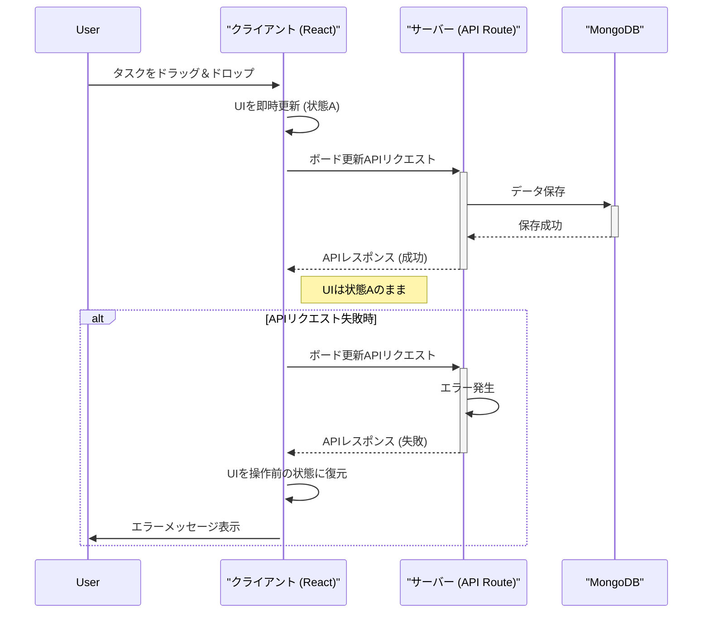

# Trello クローンアプリ

Next.js (App Router), NextAuth.js, dnd-kit を使用して作成した Trello 風のカンバンボードアプリケーションです。
ユーザー認証機能を備え、ドラッグ＆ドロップでタスクを直感的に管理できます。

※本アプリは Gemini-CLI を使って AI 駆動開発で作成したアプリです。

## デプロイURL

https://geminicli-todo.vercel.app/auth/signin

## 機能

- **認証機能**: NextAuth.js による認証システム
  - サインアップ機能と、Credentials Provider を利用したログイン
  - ユーザー情報はMongoDBで管理
- **カンバンボード**:
  - リストとカードでタスクを可視化
  - ドラッグ＆ドロップによるカードの移動（リスト間・リスト内）
  - タスク・リストの追加、編集、削除
  - 楽観的 UI 更新によるスムーズな操作感
  - **ユーザーごとにボード情報をMongoDBで永続化**

## 技術スタック

<p>
  
  
  
  
  
  
</p>

- **Framework**: Next.js 15.3.5 (App Router)
- **Language**: TypeScript 5
- **Authentication**: NextAuth.js 5.0.0-beta.29
- **UI**: React 19.1.0
- **Styling**: styled-components 6.1.19
- **Drag & Drop**:
  - @dnd-kit/core 6.3.1
  - @dnd-kit/sortable 10.0.0
- **Data Fetching/Persistence**:
  - MongoDB
- **Validation**: Zod
- **Testing**: Jest, React Testing Library
- **Linting**: ESLint 9

## 開発環境の構築

### 前提条件

- Node.js 20 以上
- npm, yarn, pnpm, or bun
- Docker (MongoDBのローカル環境構築のため)

### インストールと実行

```bash
# リポジリをクローン
git clone https://github.com/hideaki1979/geminicli_todo
cd geminicli_todo

# 依存関係をインストール
npm install

# MongoDBをDockerで起動
docker-compose up -d

# .env.localファイルを作成し、環境変数を設定
# MONGODB_URI="mongodb://localhost:27017/gemini-cli-app"
# NEXTAUTH_URL=http://localhost:3000
# NEXTAUTH_SECRET="opensslで生成したシークレットキー(openssl rand -base64 32)"

# 開発サーバーを起動（Turbopackを利用する場合は next dev --turbo）
npm run dev
```

ブラウザで [http://localhost:3000](http://localhost:3000) を開いてアプリケーションを確認できます。

## スクリプト

```bash
# 開発サーバー起動
npm run dev

# プロダクションビルド
npm run build

# プロダクションサーバー起動
npm run start

# コード品質チェック
npm run lint

# テスト実行
npm run test
```

## アーキテクチャ

### システム構成図


### 楽観的UI更新のシーケンス図

タスク（カード）を別のリストにドラッグ＆ドロップで移動する際の、楽観的UI更新のフローを示します。



### ER図 (データ構造)

MongoDBには、`users` コレクションと `boards` コレクションが作成されます。`boards` コレクションの各ドキュメントは `userId` を持ち、特定のユーザーに紐づきます。


## プロジェクト構造

```
src/
├── app/
│   ├── api/                 # API Routes
│   │   ├── auth/[...nextauth]/route.ts  # NextAuth.js 認証エンドポイント
│   │   ├── auth/register/route.ts # ユーザー登録API
│   │   └── board/route.ts   # ボードデータ取得/更新API
│   ├── auth/signin/         # サインインページ
│   ├── auth/signup/         # サインアップページ
│   ├── profile/             # プロフィールページ
│   ├── page.tsx             # メインページ（カンバンボード）
│   └── layout.tsx           # ルートレイアウト
├── components/
│   ├── Board.tsx            # カンバンボード全体
│   ├── List.tsx             # タスクリスト
│   ├── Card.tsx             # タスクカード
│   ├── DndBoardContent.tsx  # D&Dロジックを含むボードコンテンツ
│   ├── Header.tsx           # アプリケーションヘッダー
│   ├── Profile.tsx          # ユーザープロファイル表示
│   ├── Modal.tsx            # 汎用モーダルコンポーネント
│   ├── SignInForm.tsx       # サインインフォーム
│   ├── SignUpForm.tsx       # サインアップフォーム
│   └── ...                  # その他UIコンポーネント
├── hooks/
│   └── useBoard.ts          # ボードの状態管理と操作ロジックをカプセル化
│   └── useModal.ts          # モーダル表示状態管理
├── lib/
│   ├── mongodb.ts           # MongoDB接続設定
│   └── registry.tsx         # styled-components用レジストリ
├── types/
│   ├── index.ts             # プロジェクト共通の型定義
│   ├── next-auth.d.ts       # NextAuth.jsの型拡張
│   └── global.d.ts          # グローバルな型定義
├── validation/
│   ├── boardValidation.ts   # Zodによるボードデータのバリデーションスキーマ
│   └── userValidation.ts    # Zodによるユーザーデータのバリデーションスキーマ
└── auth.ts                  # NextAuth.js の設定ファイル

public/
└── ...                      # 静的ファイル

```

## 主要機能

### 1. 認証 (Authentication)

- **`src/auth.ts`**: NextAuth.js の設定の中心。`CredentialsProvider` を使用し、ユーザー認証を行います。ユーザー情報はMongoDBに永続化されます。
- **`src/app/auth/signup/page.tsx`**: 新規ユーザー登録ページ。
- **`src/app/auth/signin/page.tsx`**: カスタムサインインページ。
- **セッション管理**: 認証されたユーザー情報はセッションで管理され、未認証の場合はサインインページにリダイレクトされます。`callbacks` を用いて、セッション情報にユーザー ID を含めています。

### 2. カンバンボード (Board)

- **`src/components/Board.tsx`**: ボード全体のレイアウトとリストのレンダリングを担当。
- **`src/components/List.tsx`**, **`src/components/Card.tsx`**: それぞれリストとカードの UI コンポーネント。
- **`@dnd-kit`**: ドラッグ＆ドロップ機能を提供。`DndContext` や `SortableContext` を利用して、カードの並べ替えやリスト間の移動を実現しています。
- **状態管理とデータ永続化**:
  - **`src/hooks/useBoard.ts`**: ボードの状態（リストやカードのデータ）をクライアントサイドで管理し、API通信ロジックをカプセル化するカスタムフックです。
  - **楽観的 UI 更新**: ユーザーの操作（タスク追加・移動など）を即座に UI へ反映させ、バックグラウンドで API 通信を行います。通信に失敗した場合は、UI の状態を元に戻し、エラーメッセージを表示します。これにより、スムーズなユーザー体験を実現しています。
  - **API (`/api/board`)**: フロントエンドからのリクエストを受け取り、MongoDB を使用してユーザーごとのボードデータを永続化します。データの検証には `Zod` (`src/validation/boardValidation.ts`) を利用しています。

## ライセンス

このプロジェクトは学習目的で作成されています。